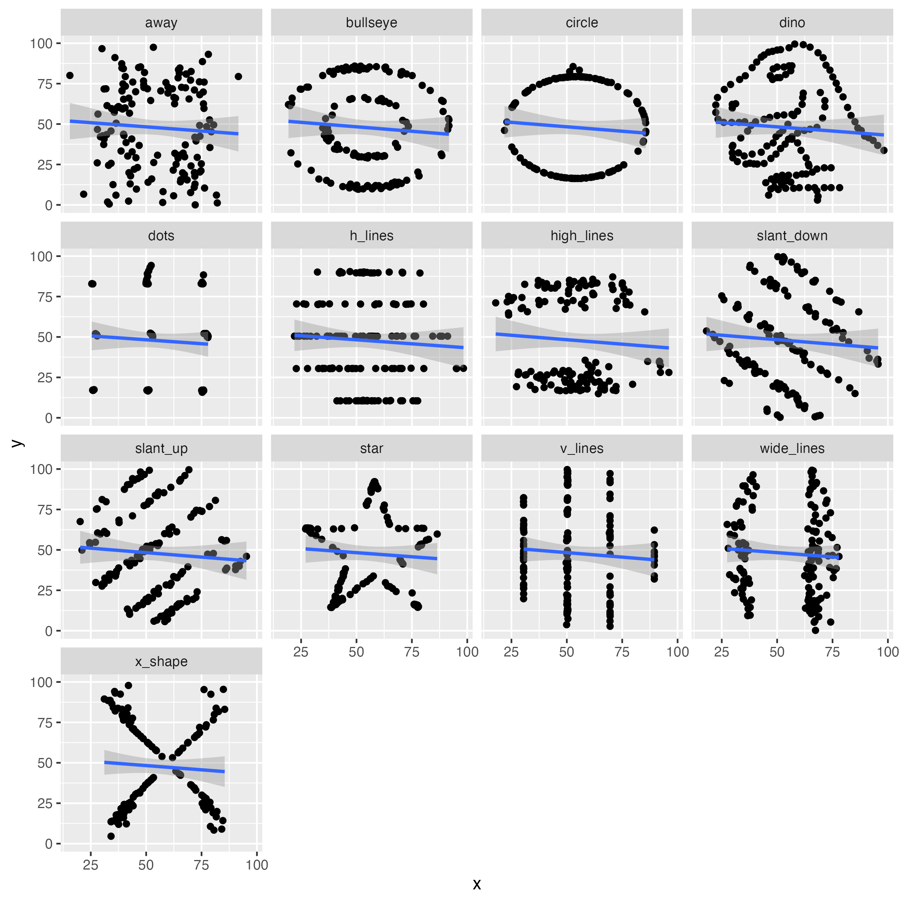

# **Week 5 Activity**

## **PROBLEM 1**

> Lets look at the Anscombe’s Quartet data. There are four different data sets. Anscombe, F. J. (1973). "Graphs in Statistical Analysis". American Statistician. 27 (1): 17–21. <doi:10.1080/00031305.1973.10478966>. JSTOR 2682899.

Read the Data Set and Explored:

```         
#read dataset
anscombe_quartet = readRDS("dataset/anscombe_quartet.rds")
str(anscombe_quartet)
```

-   What does the function str() do? : to display the structure of the dataset

### Summary statistics: to calculate the mean, minimum, maximum and correlation coefficients for x and y

```         
anscombe_quartet %>% 
  group_by(dataset) %>% #group dataset based on 'dataset'
  summarise(
    mean_x    = mean(x), #calculates the mean of 'x' in dataset;
    mean_y    = mean(y), #calculates the mean of 'y' in dataset;
    min_x     = min(x), #gives smallest x value
    min_y     = min(y), #gives smallest y value
    max_x     = max(x), #gives largest x value
    max_y     = max(y), #gives largest y value
    crrltn    = cor(x, y) #calculates correlation coefficient between x and y
  )
```

### Data set plot with ggplot:

```         
require(ggplot2) #ggplot2 package for plotting

ggplot(anscombe_quartet, aes(x=x,y=y)) +  #plot dataset; default aesthetic mapping for x and y variables
  geom_point() +    #add points for each x, y point for scatter plot
  geom_smooth(method = "lm",formula = "y ~ x") +  #smooth line for linear model line of best fit
  facet_wrap(~dataset)  #arrange plot into seperate panels based on dataset
```



### Question answers:

-   What do the plots tell us about the different datasets? The plots show how although there were similar summary statistics between the datasets, the distributions are actually quite different in a way that might be misleading without looking at the plots.

-   Describe the relationship between x and y in the different datasets.

-   Would linear regression be an appropriate statistical model to analyse the x-y relationship in each dataset?

Dataset 1: there is a linear relationship between x and y with some variance around the line of best fit. A linear regression would be an appropriate statistical model to analyse the x-y relationship as there seems to be an even distribution around the regression line.

Dataset 2: there is a non-linear relationship between x-y as the points follow a curved pattern. Therefore, a linear regression does not seem like a good fit to identify the x-y relationship.

Dataset 3: there is a linear relationship between x and y besides the outlier. A linear regression might be suitable after removing the outlier. However, including the outlier, the regression line would be highly affected and hence not be a good fit for using a linear regression analysis.

Dataset 4: The x-values are constant for this dataset besides an outlier point. Therefore, as there is no linear relationship between x and y with the correlation only significantly influenced by the one outlier of x, a linear regression model would not be suitable.

-   What conclusions can you draw for the plots and summary statistics?

The plots and summary statistics show that although there are similar summary statistics with the datasets, their distributions are significantly different. This indicates how just looking at the summary statistics is not sufficient enough, and it is important to look at the data visualisation as well in order to get a sufficient idea of the underlying relationships of the data. In particular, this can be important for determining the most appropriate statistical analysis.

## PROBLEM 2

Loaded the Data Set and Explored:

```         
#read dataset
datasaurus_dozen = readRDS("dataset/datasaurus_dozen.rds")
str(datasaurus_dozen)
```

-   how many rows and columns does the datasaurus_dozen file have? rows = 1,846 rows columns = 3 columns

### Dataset Plot

```         
ggplot(datasaurus_dozen, aes(x = x, y = y)) + #plot dataset; default aesthetic mapping for x and y variables
  geom_point() +  #add points for each x, y point for scatter plot
  facet_wrap(~dataset)  #seperate plots to be based on each panel
```

### Calculations of Summary Statistics:

-   correlations and summary statistics for x and y in all datasets:

```         
datasaurus_dozen %>% 
  group_by(dataset) %>% 
  summarise(
    mean_x    = mean(x), #calculates the mean of 'x' in dataset;
    mean_y    = mean(y), #calculates the mean of 'y' in dataset;
    min_x     = min(x), #gives smallest x value
    min_y     = min(y), #gives smallest y value
    max_x     = max(x), #gives largest x value
    max_y     = max(y), #gives largest y value
    crrltn    = cor(x, y) #calculates correlation coefficient between x and y
  )
```

### Relationship Plot: relationships between x and y in each dataset including the line of best fit.

```         
require(ggplot2)  #ggplot2 pacakge for plotting

ggplot(datasaurus_dozen, aes(x=x,y=y)) +  #plot dataset; default aesthetic mapping for x and y variables
  geom_point() +  #add points for each x, y point for scatter plot
  geom_smooth(method = "lm",formula = "y ~ x") +  #add smooth line (linear model) to fit the data
  facet_wrap(~dataset)  #seperate points in different panels based on dataset
```


### Conclusions:

-   what can you draw for the plots and summary statistics?:

    Although the summary statistics are very similar across all the data sets, the visual plots reveal diverse distributions between x and y despite the similar correlation coefficients. Particularly, the line of best fit can be misleading as they are based on linear regression, the datasets with a clear non-linear pattern like the star dataset is not represented sufficiently with the best fit line. Additionally, datasets like the h_lines and v_lines suggest that the homoscedasticity is not consistent violating one of the assumptions of a linear regression. Overall, while the summary statistics indicate a consistent mean for x and y and similar correlation coefficients across all the datasets, the distribution and line of best fit unable to capture the whole scope of the datasets indicates different analytical approaches are important to accurately capture the data.
